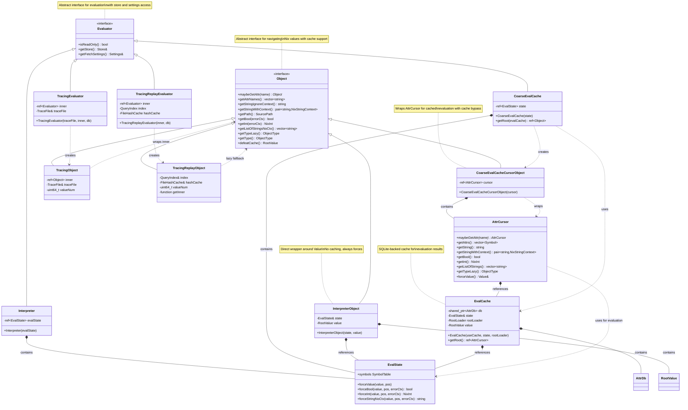

# Evaluator Architecture

This document describes the architecture of the Evaluator and Object interfaces in Nix's eval-cache redesign.

## Overview

The Evaluator architecture provides a uniform API for navigating and evaluating Nix expressions, with support for both direct evaluation and cached evaluation. The design consists of two main abstract interfaces:

- **`Evaluator`**: Provides access to evaluation context (store, settings, read-only mode)
- **`Object`**: Represents a Nix value with methods to navigate and extract typed data

## Class Diagram



## Components

### Abstract Interfaces

#### `Object` Interface

The `Object` interface (`src/libexpr/include/nix/expr/evaluator.hh`) provides a uniform API for navigating Nix values:

- **Attribute access**: `maybeGetAttr()`, `getAttrNames()`
- **Type queries**: `getTypeLazy()`, `getType()`
- **Typed extraction**: `getString*()`, `getPath()`, `getBool()`, `getInt()`, `getListOfStringsNoCtx()`
- **Cache bypass**: `defeatCache()` - forces evaluation and returns the underlying `Value`

The interface uses `std::string` for attribute names (rather than `Symbol`) to avoid coupling to a specific symbol table. This may change in the future for performance reasons.

#### `Evaluator` Interface

The `Evaluator` interface (`src/libexpr/include/nix/expr/evaluator.hh`) provides access to evaluation context:

- **Store access**: `getStore()` - access to the Nix store
- **Settings**: `getFetchSettings()` - fetcher configuration
- **Mode checking**: `isReadOnly()` - whether store modifications are allowed

### Implementations

#### `Interpreter` + `InterpreterObject`

The `Interpreter` implementation (`src/libexpr/include/nix/expr/interpreter.hh`) provides direct evaluation without caching:

- Wraps an `EvalState` reference
- `InterpreterObject` directly wraps a `RootValue`
- All operations force evaluation immediately
- `defeatCache()` simply returns the wrapped `Value` (no cache to bypass)

**Use case**: Direct evaluation when caching is not needed or when working with values that aren't suitable for caching.

#### `CoarseEvalCache` + `CoarseEvalCacheCursorObject`

The `CoarseEvalCache` implementation (`src/libexpr/include/nix/expr/coarse-eval-cache.hh`) provides SQLite-backed cached evaluation:

- Wraps an `EvalState` reference
- Uses `EvalCache` for storage (SQLite database)
- `CoarseEvalCacheCursorObject` wraps an `AttrCursor` from the eval cache
- Operations may return cached results without forcing evaluation
- `defeatCache()` forces evaluation to get the actual `Value`, bypassing lossy cache

**Use case**: Flake evaluation where the same flake lock produces the same outputs. The cache is keyed by the flake lock fingerprint.

**Lossy caching**: The eval cache stores values in a lossy format (e.g., paths become strings without context). When accurate type information is needed, use `defeatCache()` to get the original `Value`.

#### Tracing Evaluators

The tracing eval cache provides fine-grained caching by recording I/O operations. See `doc/tracing-eval-cache-implementation.md` for details.

**`TracingEvaluator`** (`src/libexpr/include/nix/expr/tracing-evaluator.hh`): Records traces during evaluation
- Wraps an inner `Evaluator` (typically `Interpreter`)
- Logs queries and results to a trace file
- Returns `TracingObject` wrappers

**`TracingReplayEvaluator`** (`src/libexpr/include/nix/expr/tracing-replay-evaluator.hh`): Replays cached results
- Loads a previous trace and builds a `QueryIndex`
- Validates file hashes and environment variables before returning cached results
- Falls back to inner evaluator on cache miss
- Returns `TracingReplayObject` wrappers

### Supporting Classes

#### `EvalState`

The core Nix evaluator (`src/libexpr/eval.hh`):

- Manages symbol tables, environments, and evaluation state
- Provides forcing functions (`forceValue`, `forceBool`, `forceInt`, etc.)
- Both `Interpreter` and `CoarseEvalCache` wrap an `EvalState`

#### `EvalCache` and `AttrCursor`

The eval cache implementation (`src/libexpr/include/nix/expr/eval-cache.hh`):

- `EvalCache`: SQLite-backed storage for evaluation results, keyed by hash
- `AttrCursor`: Navigation API for cached attribute sets
- `CoarseEvalCacheCursorObject` wraps `AttrCursor` to implement the `Object` interface

## Key Design Insights

### Uniform API

The `Object` interface provides a single API that works with both cached and uncached evaluation. Client code can be written once and work with either backend.

### Cache Bypass

The `defeatCache()` method acknowledges that the eval cache is lossy (e.g., paths cached as strings). When accurate type information or full context is needed, clients can bypass the cache and get the original `Value`.

### Composition Over Inheritance

The design favors composition:
- `Interpreter` contains an `EvalState`
- `InterpreterObject` contains a `RootValue`
- `CoarseEvalCacheCursorObject` contains an `AttrCursor`

This allows the implementations to be swapped without changing client code.

## Usage Example

```cpp
// Works with either Interpreter or CoarseEvalCache
void processFlakeOutput(ref<Object> obj) {
    // Navigate to an attribute
    auto packages = obj->maybeGetAttr("packages");
    if (!packages) return;

    auto x86_64 = packages->maybeGetAttr("x86_64-linux");
    if (!x86_64) return;

    // Get attribute names
    auto names = x86_64->getAttrNames();

    // Extract typed data (may use cache)
    for (auto & name : names) {
        auto pkg = x86_64->maybeGetAttr(name);
        if (expr::helpers::isDerivation(*pkg)) {
            // Need accurate type info? Bypass cache
            auto value = pkg->defeatCache();
            // ... work with Value directly
        }
    }
}
```

## Files

- **Interfaces**: `src/libexpr/include/nix/expr/evaluator.hh`
- **Interpreter**: `src/libexpr/include/nix/expr/interpreter.{hh,cc}`, `src/libexpr/interpreter-object.{hh,cc}`
- **CoarseEvalCache**: `src/libexpr/include/nix/expr/coarse-eval-cache.{hh,cc}`, `src/libexpr/coarse-eval-cache-cursor-object.{hh,cc}`
- **EvalCache**: `src/libexpr/include/nix/expr/eval-cache.hh`, `src/libexpr/eval-cache.cc`
- **Tracing**: `src/libexpr/include/nix/expr/tracing-*.hh`, `src/libexpr/tracing-*.cc` (see `doc/tracing-eval-cache-implementation.md`)
- **Tests**: `src/libexpr-tests/evaluator.cc`, `src/libexpr-tests/trace-types.cc`, `src/libexpr-tests/file-hash-cache.cc`
